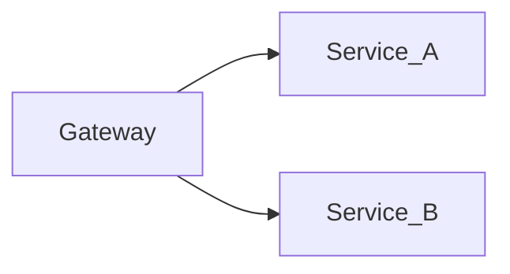

Customizing the Gateway

While the Spring cloud gateway has numerous built in filters sometimes you may need 

A very special form of redirect that wasn't easy to construct with the built in filters. 

a request to https://www.ellin.com/ -> should redirect to /website/%s/home where %s should be replaced with the domain from the 




In order to accomplish this a custom filter can be used.  Filters are applied in a chain and can manipulate the request before it is sent to the downstream server or manipulate the response after it is returned from the server. 

## The Filter

Filters in inherit from `GatewayFilterFactory` and return an instance of a`GatewayFilter`

```java
 public GatewayFilter apply(HttpStatus httpStatus, String replacement) {
        return (exchange, chain) -> chain.filter(exchange).then(Mono.defer(() -> {
            if (!exchange.getResponse().isCommitted()) {
                String host = exchange.getRequest().getURI().getHost();
                String newPath = String.format(replacement,host);
                ServerWebExchangeUtils.setResponseStatus(exchange, httpStatus);
                ServerHttpResponse response = exchange.getResponse();
                response.getHeaders().set("Location", newPath);
                return response.setComplete();
            } else {
                return Mono.empty();
            }
        }));
    }
```

This filter looks at the request and builds the desired redirect.

The filter can be used in the java DSL for configuring the gateway or it can be referenced by it's name in the application resource file.
```
  - id: redirect_default_path_to_deeplink
        uri: ${pathURI}
        predicates:
        - Path=/
        filters:
        - RedirectToPathFromHostName=/website/%s/home,301
```

Our filter accepts two parameters. The `redirectCode` and the `url`  The parameters are passed to the filter factory via the inner Config class.

## Unit Testing. 

Unit testing of the filter turned out to be a little difficult.  This is because in order to properly call the filter you need a live server.   My first attempt at this used httpbin.org as a destination uri of my route. 

```yaml
        - id: default_path_to_deeplink
        uri: http://httpbin.org/anything
        order: 10000
        predicates:
        - Path=/
        filters:
        - RedirectToPathFromHostName=/website/%s/home,301
```
We can validate that the redirect was correct by examining the response that the gatewat returns to the Spring WebTestClient.

```java
@Test
public void setRequestHeaderFilterWorks() {
    testClient.get().uri("/")
    .header("Host", "ellin.com")
    .exchange()
    .expectStatus().is3xxRedirection()
    .expectHeader().valueEquals(HttpHeaders.LOCATION,"/website/ellin.com/home");
}
```

This particular request does not actually make a call to httpbin.org because it actually returns a redirect.  We can examine the `Location` header to determine if the code worked as expected.

Unfortunately, the uri is a required field even for redirects where the Gateway will actually never call the the defined uri.  In addtion the gateway buids an InetAddress object internally and will result in a UnknownHostException if run on a machine not connected to the internet.

```java
java.net.UnknownHostException: httpbin.org
	at java.base/java.net.InetAddress$CachedAddresses.get(InetAddress.java:792
```
        
One option for dealing with this is to externalize the configuration and provide localhost as the uri.  This way we don't need to worry about the resolution of external addresses during the test.

by adding a `TestPropertySource` we can override the uri during the test.

```java
@TestPropertySource(properties = "pathURI=http://localhost:8080/httpbin/anything")
```